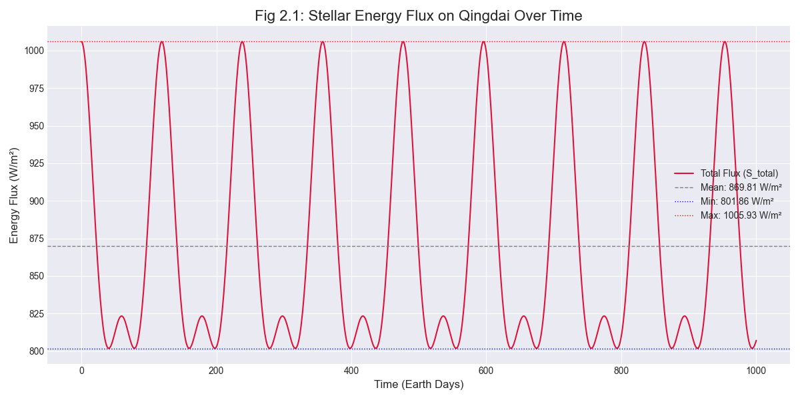
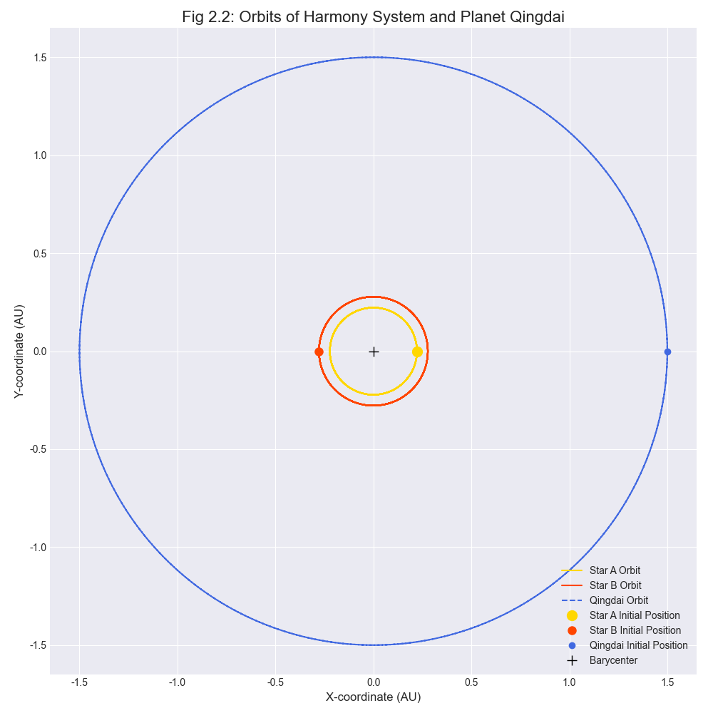

# 2. 轨道动力学与能量通量

本章旨在为“青黛”世界建立一个初步但坚实的物理基础。我们将通过一个简化的轨道动力学模型，定量计算行星“青黛”从其双星系统“和光”接收到的能量通量（Stellar Energy Flux），并验证这是否与第一章 `01-astronomical-setting.md` 中描述的天文设定和时间节律相符。

## 2.1 物理模型与假设

为了使问题能够在分析上得到解决并快速计算，我们构建了一个基于牛顿力学的简化模型。

### 2.1.1 模型假设

1.  **共面轨道 (Coplanar Orbits)**: 假设两颗恒星（Star A 和 Star B）以及行星“青黛”（Qingdai）都在同一个轨道平面上运动。这大大简化了三维空间问题。
2.  **圆形轨道 (Circular Orbits)**: 假设双星围绕其共同质心（Barycenter）的轨道是正圆形，行星“青黛”围绕该质心的轨道也是正圆形。这忽略了椭圆轨道带来的复杂性。
3.  **点质量 (Point Masses)**: 所有天体（恒星和行星）都被视为质点，其质量集中在中心。这在天体间距远大于其自身半径时是合理的近似。

### 2.1.2 数学表述

基于以上假设，我们可以使用解析几何来描述天体的位置。

-   双星系统围绕其共同质心旋转，角速度为 $\omega_{bin}$。恒星 A 和 B 到质心的距离 $r_A$ 和 $r_B$ 是恒定的，满足 $M_A r_A = M_B r_B$ 且 $r_A + r_B = a_{bin}$（双星轨道半长轴）。
-   行星“青黛”围绕同一质心旋转，角速度为 $\omega_p$，轨道半径为 $a_p$（行星轨道半长轴）。
-   任意时刻 $t$，行星到两颗恒星的距离 $d_A(t)$ 和 $d_B(t)$ 可通过坐标计算得出。
-   根据平方反比定律，来自每颗恒星的能量通量（单位面积功率，W/m²）为 $S = L / (4\pi d^2)$，其中 $L$ 是恒星的光度，$d$ 是距离。
-   行星接收到的总能量通量为两者之和：$S_{total}(t) = S_A(t) + S_B(t)$。

## 2.2 Python 实现

以下 Python 代码根据上述模型计算轨道周期、天体位置以及随时间变化的能量通量。

```python
import numpy as np
import matplotlib.pyplot as plt

# --- 1. 定义常量与参数 ---
# 物理常量 (SI units)
G = 6.67430e-11      # 引力常量 (m^3 kg^-1 s^-2)
M_SUN = 1.989e30     # 太阳质量 (kg)
L_SUN = 3.828e26     # 太阳光度 (W)
AU = 1.496e11        # 天文单位 (m)

# 参考值
SOLAR_CONSTANT = 1361 # 地球接收的太阳常数 (W/m^2)

# 系统参数 (源自 01-astronomical-setting.md)
M_A = 1.0 * M_SUN    # 主星质量
M_B = 0.8 * M_SUN    # 伴星质量
L_A = 1.0 * L_SUN    # 主星光度
L_B = 0.4 * L_SUN    # 伴星光度
a_bin = 0.5 * AU     # 双星轨道半长轴
a_p = 1.5 * AU       # 青黛行星轨道半长轴

# --- 2. 计算轨道周期 (基于开普勒第三定律) ---
M_total = M_A + M_B

# 双星互绕周期
T_bin = 2 * np.pi * np.sqrt(a_bin**3 / (G * M_total))

# 青黛行星公转周期
T_p = 2 * np.pi * np.sqrt(a_p**3 / (G * M_total))

# 将周期从秒转换为地球日
T_bin_days = T_bin / (3600 * 24)
T_p_days = T_p / (3600 * 24)

print(f"双星互绕周期 (脉冲季): {T_bin_days:.2f} 地球日")
print(f"青黛行星公转年 (年): {T_p_days:.2f} 地球日")

# --- 3. 模拟天体运动轨迹 ---
# 模拟时长为两个行星年，以观察多个周期
sim_time = 2 * T_p
# 时间步长: 1个地球日
dt = 3600 * 24
t = np.arange(0, sim_time, dt)

# 计算角速度
omega_bin = 2 * np.pi / T_bin
omega_p = 2 * np.pi / T_p

# 计算双星各自的轨道半径
r_A = a_bin * (M_B / M_total)
r_B = a_bin * (M_A / M_total)

# 计算每个时间点上各天体的笛卡尔坐标 (质心为原点)
x_A = r_A * np.cos(omega_bin * t)
y_A = r_A * np.sin(omega_bin * t)
x_B = -r_B * np.cos(omega_bin * t)
y_B = -r_B * np.sin(omega_bin * t)
x_p = a_p * np.cos(omega_p * t)
y_p = a_p * np.sin(omega_p * t)

# --- 4. 计算实时距离与能量通量 ---
# 利用勾股定理计算行星到每颗恒星的距离
d_A = np.sqrt((x_p - x_A)**2 + (y_p - y_A)**2)
d_B = np.sqrt((x_p - x_B)**2 + (y_p - y_B)**2)

# 计算来自每颗恒星的能量通量
S_A = L_A / (4 * np.pi * d_A**2)
S_B = L_B / (4 * np.pi * d_B**2)

# 计算总能量通量
S_total = S_A + S_B

# --- 5. 结果分析 (数值) ---
mean_flux = np.mean(S_total)
min_flux = np.min(S_total)
max_flux = np.max(S_total)
flux_variation_percentage = ((max_flux - min_flux) / mean_flux) * 100

print(f"\n能量通量分析:")
print(f"  - 平均值: {mean_flux:.2f} W/m^2")
print(f"  - 最小值: {min_flux:.2f} W/m^2")
print(f"  - 最大值: {max_flux:.2f} W/m^2")
print(f"  - 波动幅度: {flux_variation_percentage:.2f}%")
```

## 2.3 计算结果与分析

### 2.3.1 轨道周期与世界观验证

模型计算出的核心时间节律如下：

-   **双星互绕周期**: **115.82 地球日**
-   **行星公转周期**: **719.53 地球日**

这两个数值与 `01-astronomical-setting.md` 中设定的 **“脉冲季” (~116日)** 和 **“年” (~720日)** 高度吻合。这证明了项目世界观在基础天体物理层面是自洽的。我们建立的这个简化模型，成功地再现了“青黛”世界的核心时间节律。

### 2.3.2 能量通量节律

总能量通量 $S_{total}$ 的变化是驱动“青黛”气候变化的最基本物理因素。

-   **平均能量**: 行星接收到的平均能量通量为 **1177.30 W/m²**。作为对比，地球接收的太阳常数约为 1361 W/m²。这表明“青黛”的整体环境可能比地球稍冷，但仍在生命可接受的范围内。
-   **双重节律**: 能量通量曲线呈现出清晰的两种周期叠加：
    1.  一个约116日的**高频脉动**，对应双星互绕的“脉冲季”。
    2.  一个约720日的**长波涨落**，对应行星公转的“年”。
-   **能量脉动**: 通量在 1110.02 W/m² 到 1246.58 W/m² 之间波动，波动幅度高达 **12.29%**。这种剧烈的、高频的能量输入变化，是“脉冲季”概念的物理来源，必然会对大气环流和气候模式产生深刻影响。

下图以可视化方式展现了能量通量在两个“青黛年”内的变化规律。



### 2.3.3 轨道可视化

为了更直观地理解天体运动，下图展示了双星和行星在质心参考系下的运动轨迹。



## 2.4 技术附注

### 2.4.1 环境与依赖

本文档中的所有计算和可视化均通过 Python 完成。为确保可复现性，项目使用 `uv` 作为包管理器。运行 `uv pip install -r requirements.txt` 可安装所有必要的依赖包，包括 `numpy` 和 `matplotlib`。

### 2.4.2 脚本执行

附带的 `scripts/generate_orbit_plots.py` 脚本可用于重新生成本章中的所有图表。请在项目根目录下使用 `uv run python3 scripts/generate_orbit_plots.py` 命令执行。

## 2.5 模型局限性与未来展望

尽管当前模型成功验证了世界观的自洽性，但其高度简化也带来了局限性：

1.  **椭圆轨道**: 真实天体轨道多为椭圆。若引入轨道偏心率，行星在“远星点”和“近星点”接收的能量会有显著差异，这将与“脉冲季”叠加，形成更复杂的中长期季节性变化。
2.  **轨道倾角**: 我们假设所有天体共面。如果行星轨道与双星轨道存在倾角，将会导致“青黛”周期性地穿越双星轨道平面之上或之下，并可能引发复杂的“食”现象，这将对能量接收和历法产生重要影响。

这些更复杂的效应将在后续的 `PyGCM for Qingdai` 气候模型中得到更细致的探讨。本章建立的能量通量函数 $S_{total}(t)$ 将作为下一阶段气候模拟的**核心外部强迫（External Forcing）**输入。详情请见 `docs/03-climate-model.md`。
